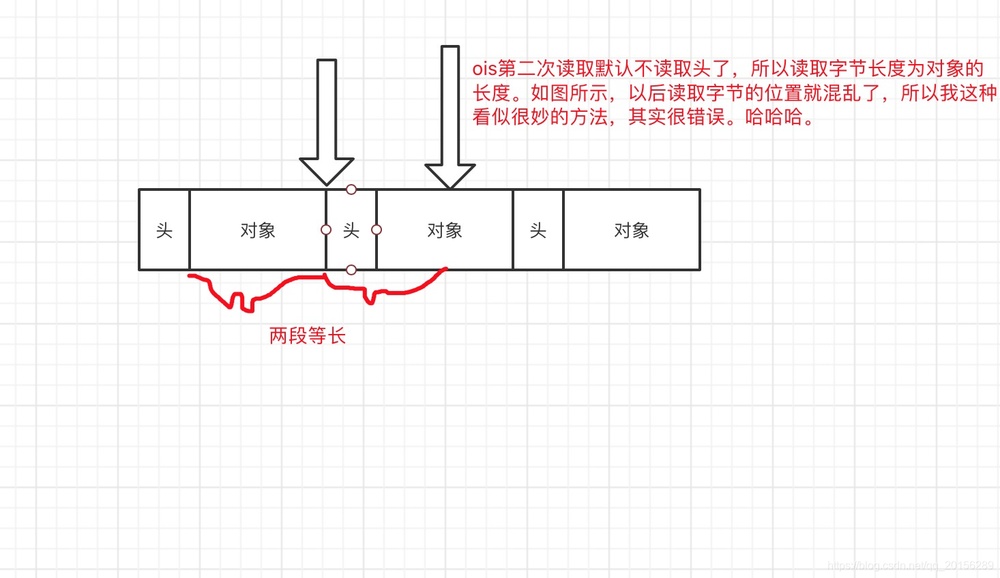
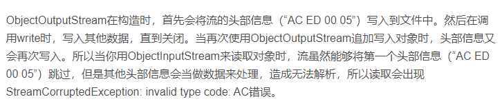

# 细节

<style>
.emphasize{
   color:red;
   font-size:20px;
}

</style>

## 1. 报错`invalid type code: AC`，客户单、服务端都存在

1. 分析
    - 客户端登录后，创建了`objectInputStream`和`bjectOutputStream`，只给通信线程传了`socket`
      ，之后在通信线程中<span class="emphasize">重新创建了</span>输入流和输出流进行通信；多次定义问题；
    - 首次读取读取头，后面读取不读取头，但如果重新创建的话，有头，后面的就读取不到争取的数据了；
    - 
2. 修改
    - 登录后把socket、输入输出流都传给通信线程，线程中不创建新输入输出流；

```java
clientConnectServerThread = new ClientConnectServerThread(socket, oos, ois);
```

## 2. 二级菜单选1查询在线用户后，先显示二级菜单再显示查询在线用户结果

1. 预期
    - 先显示查询结果，再显示主菜单，让用户选择其他选项；
2. 修改
    - 新增一个`IsThreadUsed`，有静态属性`isUsed`；
    - 用户服务和消息服务公用；
    - 每次客户端发送请求后一直等`isUsed`为`false`，收到响应后打印完结果后设置为`false`，这时客户端显示二级菜单，再设置为`true`，以便下次等待；

```java
public class IsThreadUsed {
    private static boolean isUsed = true;

    public static boolean getIsUsed() {
        return isUsed;
    }

    public static void setIsUsed(boolean newIsUsed) {
        isUsed = newIsUsed;
    }
}
```

